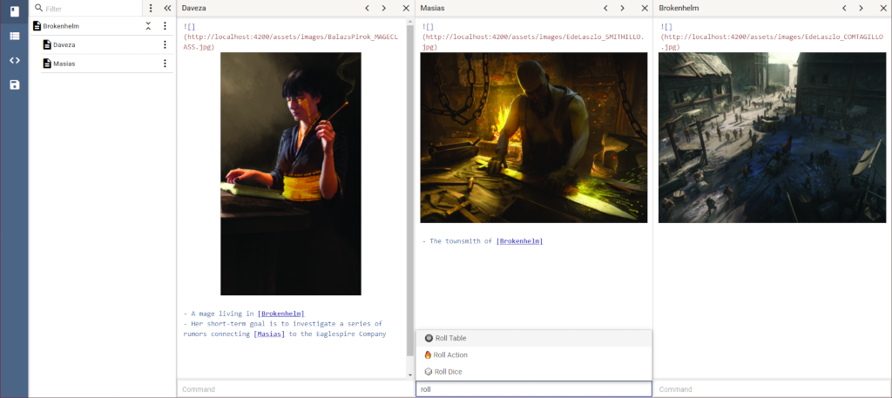
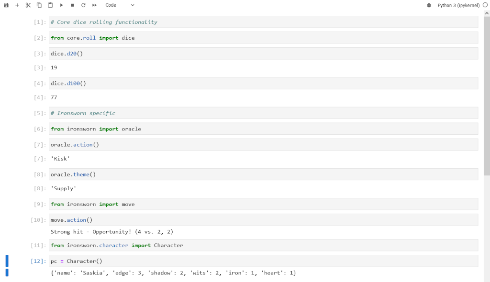

# Daniel Duligă

I have over 7 years of experience as a software engineer with a focus on developing **web** solutions. I currently specialize in the development of **Angular** applications backed by **C#** web APIs and deployed in the **cloud**.

I am also blessed with being passionate about what I do for a living, so I always strive to learn new technologies as well.

---

## 🏠 Basic information

- **Address:** Tineretului 79, Chiajna, Ilfov, Romania
- **Phone:** (+40) 0746 682 578
- **Email:** daniel.vasile.duliga@gmail.com
- **LinkedIn:**  https://www.linkedin.com/in/daniel-duliga
- **GitHub:** https://github.com/daniel-duliga

---

## 👷‍♂️ Experience

### Full Stack Senior Software Engineer

**[SBP](https://sbp-romania.com/)**
*2014 – Present*

My current responsibilities at SBP:
- **Architecture design** for new projects
- **Leading the development team** for one project
- **Hands-on development work** on multiple projects
- **Guidance and mentorship** for colleagues on all projects that I am involved with

---

## 💻 Digital Skills

- **Languages:** C#, TypeScript, SQL, Python, Rust, HTML, CSS
- **Frameworks:** .NET (Core, Standard, Framework), Entity Framework, Angular, Rocket, Bootstrap, Angular Material
- **Paradigms:** Object Oriented Programming, Functional Programming, Design Patterns
- **Cloud:** Microsoft Azure
- **Process:** Agile, Waterfall
- **Version Control:** Git, SVN
- **Code Management:** Azure DevOps, Team Foundation Server, GitHub
- **CI/CD:** Azure Pipelines, GitHub Actions
- **Editors / IDEs:** Visual Studio Code, Visual Studio, IntelliJ IDEA
- **Office:** Microsoft Office Suite, Libre & Open Office
- **Other Tools:** Node.js & NPM, Azure CLI, Postman, Open API Specification, NSwag, Jupyter Notebooks, Emacs
- **OS:** Windows, Linux

---

## 💬 Languages

- **Romanian** (mother tongue)
- **English** proficiency (listen, speak, read and write)

---

## 🎓 Education

### Faculty of Mathematics and Informatics

**[University of Bucharest](https://unibuc.ro)**, Bucharest
*2012 - 2015*

- I attended university for 2 years and a half, which helped me get a better picture of the foundations upon which all the software that we build rests.
- Due to personal circumstances I was forced to drop out.

### Grupul Scolar "Constantin Brancoveanu"

**[Grupul Scolar "Constantin Brancoveanu"](http://liceulhorezu.ro/)**, Horezu
*2009 - 2012*

---

## 🚀 Personal projects

### Write and Roll

https://github.com/daniel-duliga/write-and-roll
`TypeScript` `HTML` `CSS` `Angular` `PWA` `Codemirror`

Prototype for a creative writing web application with support for offline usage:
- Powerful markdown editor built on top of [Codemirror](https://codemirror.net/)
- Extensible through TypeScript powered "Actions"
- Hierarchical document management
- Offline usage power by Angular service workers
- Automatic deployment to GitHub pages

### trpg-cli

https://github.com/daniel-duliga/trpg-cli
`TypeScript` `Node.js` `Inquirer.js`

CLI digital companion for tabletop roleplaying games.

### trpg-journal

https://github.com/daniel-duliga/trpg-journal
`Python` `Jupyter Notebooks`

Jupyter Notebooks implementation of two basic concepts of tabletop roleplaying games: dice rolling and random table rolling. Also includes material and implementations for concepts from Shawn Tomkin's [Ironsworn](https://www.ironswornrpg.com/).

---

## 💡 Miscellaneous

- This resume was created in Markdown and rendered by [Typora](https://typora.io/) using the [Mint](https://github.com/Y1chenYao/typora-mint-theme) theme
- There's also an online version available at https://daniel-duliga.github.io/resume/index